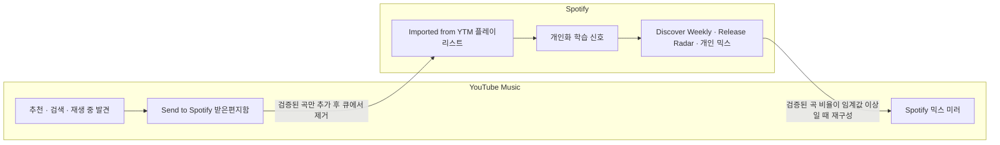

# Spotify와 YouTube Music 선곡 상호보완 설계

> 환경: Python 3.14, Spotify 개인 믹스, YouTube Music OAuth

## 1. 문제와 Python 라이브러리

| 라이브러리 | 해결한 문제 | 사용 방식 |
| --- | --- | --- |
| `ytmusicapi` | YouTube Music의 검색·플레이리스트 읽기/쓰기·OAuth | `YTMusic` 클라이언트로 곡을 검색하고, 미러와 받은편지함의 항목을 추가·제거한다. |
| `httpx` | Spotify 웹 플레이어 GraphQL 요청과 HTTP 오류 처리 | 연결 재사용이 가능한 동기 클라이언트로 플레이리스트 조회, 곡 검색, 추가 요청을 보낸다. 401은 토큰 재발급, 429는 `Retry-After`를 따라 최대 세 번 재시도한다. |
| `cryptography` | Linux Chromium에 저장된 Spotify 세션 쿠키 복호화 | 키링의 Chromium 안전 저장소 비밀값과 AES-CBC로 `sp_dc` 쿠키를 읽어 웹 플레이어 액세스 토큰을 얻는다. |
| `rich` | 수동 동기화 결과를 빠르게 판별 | 방향별 처리 상태와 추가·제거·건너뜀·모호함·오류를 터미널에서 읽기 좋게 출력한다. |
| 표준 라이브러리 `sqlite3` | 이미 검증한 매칭의 재사용과 실행 이력 보존 | 양방향 서비스 ID, 신뢰도, 실행 상태를 SQLite에 저장해 중복 검색·추가를 피한다. |
| 표준 라이브러리 `difflib`·`unicodedata`·`re` | 서비스마다 다른 곡 표기의 안전한 대조 | 제목·아티스트·앨범을 정규화하고 유사도를 산출한다. |

Spotify 전용 SDK 대신 `httpx`를 사용한 이유는 웹 플레이어 GraphQL 요청과 브라우저 세션 토큰 흐름을 직접 제어하기 위해서다. YouTube Music 쪽은 비공식 API 처리와 OAuth 세션 관리를 제공하는 `ytmusicapi`로 감싼다.

## 2. 선곡 상호보완 구조

이 자동화는 두 추천 알고리즘을 직접 결합하거나 전역 `좋아요`를 동기화하지 않는다. 대신 사용자가 YTM에서 발견한 곡을 Spotify의 학습용 플레이리스트로 보내고, Spotify가 만든 개인 믹스를 YTM에서 재생할 미러로 되돌린다. 즉, YTM의 발견 경로와 Spotify의 개인화 피드백 루프를 서로의 입력으로 사용한다.

YTM 받은편지함은 일회성 전송 큐다. 성공적으로 Spotify에 추가된 곡만 큐에서 제거하므로, 찾지 못했거나 후보가 모호한 곡은 수동 검토를 위해 남는다. Spotify의 `Imported from YTM`은 일반 재생목록으로, 전역 `Liked Songs`를 변경하지 않으면서 Spotify에 선호 신호를 제공한다.

반대 방향은 Spotify의 `Discover Weekly`, `Release Radar`, 개인 장르 믹스처럼 이미 개인화된 결과를 YTM의 전용 미러에 재구성한다. YTM에서 Spotify 믹스를 편하게 재생하면서도, Spotify 쪽 추천 결과를 잃지 않는 구조다.

각 방향의 곡 검색 결과는 제목 55%, 아티스트 25%, 앨범 10%, 재생시간 10%를 합산해 평가한다. 제목의 괄호·대괄호 부가 표기는 정규화하고, 재생시간 차이는 30초 이내에서 점진적으로 감점한다. 최고 점수가 0.72 미만이거나 2위 후보와의 점수 차가 0.025 미만이면 자동 선택하지 않는다. Spotify에서 YTM으로 보낼 때는 `ATV` 또는 `AUDIO` 유형 후보에 작은 우선순위를 준다.

동기화 작업은 먼저 Spotify 세션과 YTM OAuth를 모두 검증한다. 인증에 실패하면 어느 플레이리스트도 수정하지 않는다. 처리 결과는 추가·제거·건너뜀·모호함·오류로 나누어 기록한다.

## 3. 매칭과 데이터 보호

SQLite 이력 DB에는 서비스 간 검증 완료한 곡 ID와 매칭 신뢰도를 저장한다. 다음 동기화에서 같은 곡을 다시 검색하지 않아 중복 추가와 불필요한 API 요청을 줄인다.

!!! warning
    Spotify 믹스 미러는 모든 곡을 먼저 검색·검증한 뒤에만 대상 플레이리스트를 비우고 다시 채운다. 준비된 후보 비율이 `minimum_match_ratio`(기본 80%)보다 낮으면 기존 YTM 미러를 그대로 유지한다. 비운 뒤 채우기에 실패하면 직전 스냅샷 복구를 시도하므로, 오류 로그에서 복구 성공 여부를 확인한 후 다시 실행한다.

!!! warning
    자동 매칭에서 제외된 곡은 억지로 동기화하지 않는다. 제목, 아티스트, 앨범, 길이가 다른 라이브·리믹스·동명 곡일 수 있다. 각 서비스에서 올바른 음원을 먼저 확인하고 받은편지함 또는 원본 믹스의 항목을 정리한 뒤 재실행한다.

!!! warning
    브라우저 쿠키나 세션 토큰을 추출해 Spotify 웹 플레이어 API를 사용하는 방식은 Spotify 서비스 약관을 위반할 소지가 있다. 계정 제한이나 서비스 변경 위험을 이해하고, 가능한 경우 각 서비스가 제공하는 공식 API와 인증 방식을 우선한다.
