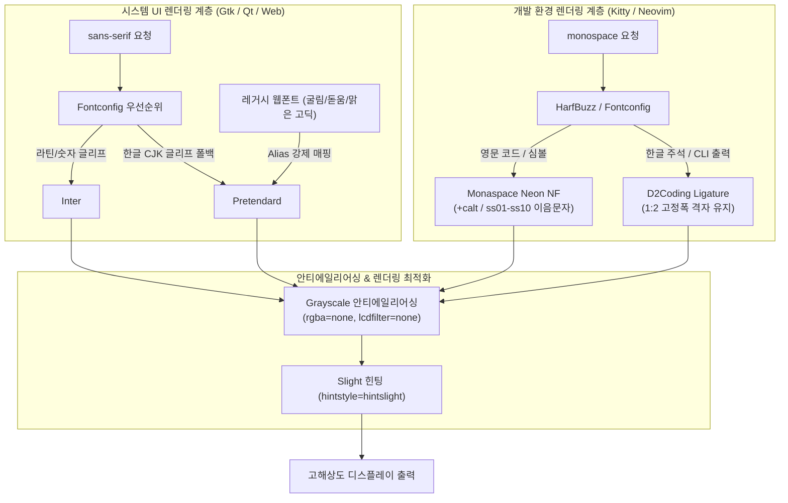

# UI 및 개발 환경 폰트 설정 치트시트

> 환경: Arch Linux, Fontconfig, Kitty, Neovim, FreeType/HarfBuzz

## 1. 패키지 설치

```shell
sudo pacman -Syu fontconfig inter-font otf-monaspace-nerdfonts ttf-d2coding-nerd
# AUR에서 Pretendard 폰트 설치
yay -S ttf-pretendard
```

- `inter-font`: 높은 x-height와 정교한 기호·숫자 가독성을 제공하는 모던 시스템 UI 영문 산세리프 표준 폰트입니다.
- `ttf-pretendard`: Inter의 메트릭스와 두께 비율을 기준으로 설계된 한글 UI 폰트입니다. Inter와 폴백 조합 시 글리프 기준선(Baseline)과 시각적 굵기 불일치가 발생하지 않습니다.
- `otf-monaspace-nerdfonts`: 깃허브 Monaspace(Neon)와 Nerd Font 심볼을 결합한 개발용 고정폭 폰트입니다. 글자 폭에 따른 여백을 유기적으로 보정하는 텍스처 힐링(`+calt`)과 OpenType 스타일 세트(`ss01`~`ss10`) 기반 프로그래밍 이음문자(Ligature)를 지원합니다.
- `ttf-d2coding-nerd`: 한글과 영문 너비 비율이 정확히 2:1로 고정된 네이버 D2Coding 폰트입니다. 코딩 이음문자와 개발용 아이콘이 내장되어 터미널과 에디터에서 한글 주석과 CLI 출력의 정렬 깨짐을 방지합니다.

## 2. 설정 파일

시스템 UI(`sans-serif`)와 터미널/에디터(`monospace`) 영역의 폰트 렌더링 체인을 분리하고, 최종 렌더링 단계에서 Grayscale 안티에일리어싱과 Slight 힌팅을 적용하여 텍스트의 선명도와 가독성을 보장합니다.



UI 영역에서는 Inter가 영문/숫자를 우선 담당하고 한글 글리프는 동일한 시각 비율을 지닌 Pretendard로 자연스럽게 폴백됩니다. 개발 환경에서는 Kitty의 HarfBuzz 엔진이 Monaspace Neon NF로 이음문자를 처리하며, 한글 글리프는 2셀 폭의 D2Coding으로 자동 연결됩니다.

`~/.config/fontconfig/fonts.conf`

```xml
<?xml version="1.0"?>
<!DOCTYPE fontconfig SYSTEM "urn:fontconfig:fonts.dtd">
<fontconfig>
    <!-- 개발 환경 고정폭 폰트 우선순위 (Monaspace Neon NF + D2Coding) -->
    <match target="pattern">
        <test qual="any" name="family"><string>monospace</string></test>
        <edit name="family" mode="prepend" binding="strong">
            <string>Monaspace Neon NF</string>
            <string>Monaspace Neon</string>
            <string>D2KodingLigature Nerd Font</string>
            <string>D2Coding ligature</string>
            <string>D2Coding</string>
            <string>Noto Sans Mono CJK KR</string>
        </edit>
    </match>

    <!-- 시스템 UI 산세리프 폰트 우선순위 (Inter + Pretendard) -->
    <match target="pattern">
        <test qual="any" name="family"><string>sans-serif</string></test>
        <edit name="family" mode="prepend" binding="strong">
            <string>Inter</string>
            <string>Pretendard</string>
            <string>Noto Sans CJK KR</string>
        </edit>
    </match>

    <!-- 레거시 한글 웹 폰트 매핑 (굴림, 돋움, 맑은 고딕 -> Pretendard) -->
    <match target="pattern">
        <test qual="any" name="family"><string>Gulim</string></test>
        <edit name="family" mode="assign" binding="same"><string>Pretendard</string></edit>
    </match>
    <match target="pattern">
        <test qual="any" name="family"><string>굴림</string></test>
        <edit name="family" mode="assign" binding="same"><string>Pretendard</string></edit>
    </match>
    <match target="pattern">
        <test qual="any" name="family"><string>Dotum</string></test>
        <edit name="family" mode="assign" binding="same"><string>Pretendard</string></edit>
    </match>
    <match target="pattern">
        <test qual="any" name="family"><string>돋움</string></test>
        <edit name="family" mode="assign" binding="same"><string>Pretendard</string></edit>
    </match>
    <match target="pattern">
        <test qual="any" name="family"><string>Malgun Gothic</string></test>
        <edit name="family" mode="assign" binding="same"><string>Pretendard</string></edit>
    </match>
    <match target="pattern">
        <test qual="any" name="family"><string>맑은 고딕</string></test>
        <edit name="family" mode="assign" binding="same"><string>Pretendard</string></edit>
    </match>
    <match target="pattern">
        <test qual="any" name="family"><string>Apple SD Gothic Neo</string></test>
        <edit name="family" mode="assign" binding="same"><string>Pretendard</string></edit>
    </match>

    <!-- 레거시 고정폭 웹 폰트 매핑 (굴림체, 돋움체 -> D2Coding) -->
    <match target="pattern">
        <test qual="any" name="family"><string>GulimChe</string></test>
        <edit name="family" mode="assign" binding="same"><string>D2KodingLigature Nerd Font</string></edit>
    </match>
    <match target="pattern">
        <test qual="any" name="family"><string>굴림체</string></test>
        <edit name="family" mode="assign" binding="same"><string>D2KodingLigature Nerd Font</string></edit>
    </match>
    <match target="pattern">
        <test qual="any" name="family"><string>DotumChe</string></test>
        <edit name="family" mode="assign" binding="same"><string>D2KodingLigature Nerd Font</string></edit>
    </match>
    <match target="pattern">
        <test qual="any" name="family"><string>돋움체</string></test>
        <edit name="family" mode="assign" binding="same"><string>D2KodingLigature Nerd Font</string></edit>
    </match>

    <!-- 공통 OpenType 이음문자 기본 활성화 -->
    <match target="font">
        <edit name="fontfeatures" mode="append">
            <string>calt=1</string>
            <string>liga=1</string>
            <string>clig=1</string>
            <string>dlig=1</string>
            <string>hlig=1</string>
            <string>rlig=1</string>
        </edit>
    </match>

    <!-- Monaspace 스타일 세트(ss01~ss10)를 Monaspace 제품군에만 한정 격리 -->
    <match target="font">
        <test name="family" compare="contains"><string>Monaspace</string></test>
        <edit name="fontfeatures" mode="append">
            <string>ss01=1</string>
            <string>ss02=1</string>
            <string>ss03=1</string>
            <string>ss04=1</string>
            <string>ss05=1</string>
            <string>ss06=1</string>
            <string>ss07=1</string>
            <string>ss08=1</string>
            <string>ss09=1</string>
            <string>ss10=1</string>
        </edit>
    </match>

    <!-- Grayscale 안티에일리어싱 및 Slight 힌팅 (OLED 및 고해상도 모니터 최적화) -->
    <match target="font">
        <edit name="antialias" mode="assign"><bool>true</bool></edit>
        <edit name="hinting" mode="assign"><bool>true</bool></edit>
        <edit name="hintstyle" mode="assign"><const>hintslight</const></edit>
        <edit name="rgba" mode="assign"><const>none</const></edit>
        <edit name="lcdfilter" mode="assign"><const>none</const></edit>
    </match>
</fontconfig>
```

`~/.config/kitty/kitty.conf`

```conf
# Kitty 메인 폰트 구성
font_family      family="Monaspace Neon NF"
bold_font        auto
italic_font      auto
bold_italic_font auto

# Monaspace OpenType Features
# 본문(Regular/SemiBold/Bold): 텍스처 힐링(+calt) 및 코딩 이음문자(+liga, +ss01..+ss10) 활성화
# 이탤릭(Italic/BoldItalic): 기울임 각도에서 m, e 등 글자 잘림(Clipping)을 방지하기 위해 -calt 적용
font_features MonaspaceNeonNF-Regular +calt +liga +clig +dlig +hlig +rlig +ss01 +ss02 +ss03 +ss04 +ss05 +ss06 +ss07 +ss08 +ss09 +ss10
font_features MonaspaceNeonNF-SemiBold +calt +liga +clig +dlig +hlig +rlig +ss01 +ss02 +ss03 +ss04 +ss05 +ss06 +ss07 +ss08 +ss09 +ss10
font_features MonaspaceNeonNF-Bold +calt +liga +clig +dlig +hlig +rlig +ss01 +ss02 +ss03 +ss04 +ss05 +ss06 +ss07 +ss08 +ss09 +ss10
font_features MonaspaceNeonNF-Italic -calt +liga +clig +dlig +hlig +rlig +ss01 +ss02 +ss03 +ss04 +ss05 +ss06 +ss07 +ss08 +ss09 +ss10
font_features MonaspaceNeonNF-BoldItalic -calt +liga +clig +dlig +hlig +rlig +ss01 +ss02 +ss03 +ss04 +ss05 +ss06 +ss07 +ss08 +ss09 +ss10
```

`~/.config/nvim/lua/config/options.lua`

```lua
-- 터미널 Neovim은 Kitty의 HarfBuzz 렌더링 엔진을 통해 폰트와 이음문자를 온전히 상속받습니다.
-- Treesitter나 플러그인에 의해 연산자 이음문자가 분절되지 않도록 은닉 레벨을 조정합니다.
vim.opt.conceallevel = 2
vim.opt.concealcursor = ""

-- 한글 등 동아시아 전각 문자의 2셀 폭 정렬을 유지합니다.
vim.opt.ambiwidth = "single"

-- Neovide 등 GUI 클라이언트 사용 시 한영 폰트 폴백 및 크기 지정
if vim.g.neovide then
  vim.opt.guifont = "Monaspace Neon NF,D2KodingLigature Nerd Font:h14"
end
```

## 3. 서비스 실행 및 확인

```shell
# 1. 사용자 폰트 캐시 강제 재생성
fc-cache -fv

# 2. Fontconfig 패턴 매칭 검증
# monospace 질의 시 Monaspace Neon NF가 1순위로 반환되는지 확인
fc-match monospace
# sans-serif 질의 시 Inter가 1순위로 반환되는지 확인
fc-match sans-serif
# 레거시 굴림/맑은 고딕 요청 시 Pretendard로 리디렉션되는지 확인
fc-match "Gulim"
fc-match "맑은 고딕"
# 레거시 굴림체 요청 시 D2Coding으로 리디렉션되는지 확인
fc-match "굴림체"

# 3. Kitty 폰트 폴백 엔진 동작 디버깅
kitty --debug-font-fallback
```

터미널 및 에디터에서 아래 테스트 문자열을 입력하여 이음문자와 한영 폭 정렬을 육안으로 확인합니다.

```text
이음문자 테스트: === !== !=== <=> -> => >= <= /* */ <!-- -->
한영 너비 정렬: [가나다라마바사]
              [12345678901234]
              [abcdefghijklmn]
```

## 4. 트러블슈팅

!!! warning
    Monaspace Neon Italic에서 `m`, `w`, `e` 등의 글자 가장자리가 잘리는 현상이 발생할 수 있습니다. 이는 이탤릭체의 기울임 각도와 텍스처 힐링(`+calt`)이 결합하여 글리프 경계 상자가 터미널 고정 셀을 침범하기 때문입니다. Kitty 설정에서 이탤릭 폰트 항목에 `-calt` 옵션을 반드시 지정해야 합니다.

!!! warning
    Monaspace의 스타일 세트(`ss01`~`ss10`)를 Fontconfig 전역 규칙에 무조건 적용하면 Inter나 Pretendard 등 일반 UI 폰트의 특정 알파벳이나 숫자 모양이 왜곡될 수 있습니다. Fontconfig 설정에서 `<test name="family" compare="contains"><string>Monaspace</string></test>` 블록으로 대상을 엄격히 격리해야 합니다.

!!! warning
    Neovim 또는 터미널에서 한글 입력 시 커서 위치와 글자 표시 위치가 어긋나는 경우, 로캘 설정(`echo $LANG`)이 `UTF-8`인지 확인하고 `vim.opt.ambiwidth`가 `single`로 설정되어 있는지 점검합니다. 터미널 폰트가 완전한 고정폭(2:1 한영 비율)을 만족하지 못하면 표와 정렬 줄이 깨집니다.

!!! warning
    웹 브라우저나 Electron 애플리케이션에서 `Gulim`이나 `Dotum` 같은 레거시 웹폰트가 깨져 보일 때는 Fontconfig의 `mode="assign" binding="same"` 규칙이 적용되었는지 `fc-match "Gulim"` 명령으로 확인합니다. 규칙 변경 후에는 실행 중인 브라우저를 완전히 재시작해야 캐시가 갱신됩니다.
