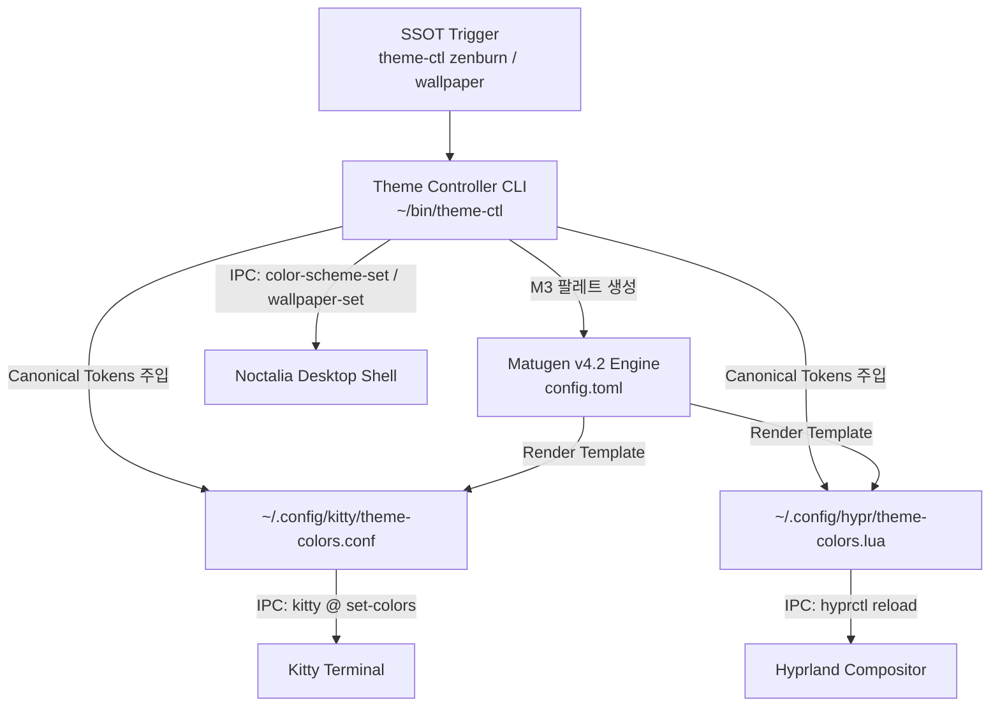

# Matugen 기반 Zenburn 테마 파이프라인 치트시트

> 환경: Arch Linux x86_64, Linux 6.12+ zen, Hyprland, Matugen v4.2+

Frosted Zenburn Glass 디자인 시스템을 기반으로 저대비 웜 차콜 어스 톤(Zenburn)과 일일 Bing UHD 배경화면에서 추출한 Material You 팔레트를 일관되게 주입하는 파이프라인입니다. 중앙 제어 스크립트인 `theme-ctl`을 단일 진실 공급원(SSOT)으로 삼아, Matugen 템플릿 엔진을 통해 45° 입체 그라디언트 엣지 라이트와 테마 토큰을 각 UI 컴포넌트(Kitty, Hyprland, Noctalia Shell)로 생성하고 데스크톱 세션 재시작 없이 런타임 IPC 신호로 즉시 동기화합니다.



`theme-ctl` 명령 실행 시 정적 Zenburn 토큰 생성 또는 Matugen 엔진을 통한 동적 팔레트 렌더링이 수행되며, 이후 각 애플리케이션의 제어 소켓(`kitty @`, `hyprctl reload`, `noctalia msg`)을 호출하여 화면 깜빡임 없이 즉시 반영합니다.

## 1. 패키지 설치

```shell
# 공식 저장소 필수 패키지 설치
sudo pacman -S --needed kitty python jq

# AUR 헬퍼를 통한 핵심 컴포넌트 설치
yay -S --needed matugen-bin hyprland noctalia-shell
```

## 2. 설정 파일

`~/.config/matugen/config.toml`

```toml
[config]
reload_apps = false

[templates.kitty]
input_path = "~/.config/matugen/templates/theme-colors.conf"
output_path = "~/.config/kitty/theme-colors.conf"

[templates.hyprland]
input_path = "~/.config/matugen/templates/theme-colors.lua"
output_path = "~/.config/hypr/theme-colors.lua"
```

`~/.config/matugen/templates/theme-colors.lua`

Hyprland 테마에 45° 각도의 1px 입체 그라디언트 엣지 라이트(`rgba(ffffff55)` 반사광 + 프라이머리 반투명 액센트)를 생성합니다.

```lua
return {
  primary = "{{colors.primary.default.hex}}",
  on_primary = "{{colors.on_primary.default.hex}}",
  surface = "{{colors.surface.default.hex}}",
  outline = "{{colors.outline.default.hex}}",
  active_border = { colors = { "rgba(ffffff55)", "rgba({{colors.primary.default.hex_stripped}}40)" }, angle = 45 },
  inactive_border = "rgba(ffffff12)",
}
```

`~/bin/theme-ctl`

`~/dotfiles/bin/theme-ctl`에 배치되고 `~/bin/theme-ctl`로 심볼릭 링크되어 실행되는 Python 스크립트입니다.

```python
#!/usr/bin/env python3
"""
theme-ctl: Central Theme Controller for Frosted Zenburn Glass & Material You.
Supports:
  - zenburn: Injects canonical hand-crafted Zenburn design tokens into all UI configs.
  - wallpaper [path]: Dynamically extracts Material You palette from wallpaper via Matugen.
  - status: Displays current theme state and token paths.
"""

import sys
import shutil
import subprocess
from pathlib import Path

HOME = Path.home()
CONFIG_DIR = HOME / ".config"
STATE_FILE = HOME / ".cache" / "theme-ctl-state.txt"

# Canonical Zenburn Design Tokens
ZENBURN_TOKENS = {
    "bg_base": "#3f3f3f",
    "bg_surface": "#4f4f4f",
    "fg_text": "#dcdccc",
    "fg_subtext": "#8f8f8f",
    "accent_primary": "#60b48a",
    "accent_secondary": "#709080",
    "warning_sand": "#f0dfaf",
    "info_cyan": "#8cd0d3",
    "error_brick": "#dca3a3",
}


def log(msg):
    print(f"[theme-ctl] {msg}", flush=True)


def reload_desktop_apps():
    """Trigger hot-reloads without killing the compositor session."""
    # 1. Hyprland
    if shutil.which("hyprctl"):
        try:
            subprocess.run(["hyprctl", "reload"], stdout=subprocess.DEVNULL, stderr=subprocess.DEVNULL)
        except Exception:
            pass

    # 2. Kitty
    kitty_theme = CONFIG_DIR / "kitty" / "theme-colors.conf"
    if kitty_theme.exists() and shutil.which("kitty"):
        try:
            subprocess.run(["kitty", "@", "set-colors", "--all", str(kitty_theme)],
                           stdout=subprocess.DEVNULL, stderr=subprocess.DEVNULL)
        except Exception:
            pass

    # 3. Noctalia
    if shutil.which("noctalia"):
        try:
            subprocess.run(["noctalia", "msg", "config-reload"], stdout=subprocess.DEVNULL, stderr=subprocess.DEVNULL)
        except Exception:
            pass
    log("UI 컴포넌트 핫 릴로드 완료.")


def apply_zenburn():
    """Write canonical Zenburn design tokens directly to application target configs."""
    log("Zenburn 고정 팔레트 적용 시작...")

    # 1. Kitty
    kitty_conf = CONFIG_DIR / "kitty" / "theme-colors.conf"
    kitty_conf.parent.mkdir(parents=True, exist_ok=True)
    kitty_content = f"""# Generated by theme-ctl (Zenburn Fixed SSOT)
foreground {ZENBURN_TOKENS["fg_text"]}
background {ZENBURN_TOKENS["bg_base"]}
selection_foreground #21322f
selection_background {ZENBURN_TOKENS["accent_primary"]}
cursor {ZENBURN_TOKENS["accent_primary"]}
cursor_text_color #21322f

active_border_color {ZENBURN_TOKENS["accent_primary"]}
inactive_border_color #3f3f3f
"""
    kitty_conf.write_text(kitty_content)

    # 2. Hyprland (45도 그라디언트 보더)
    hypr_lua = CONFIG_DIR / "hypr" / "theme-colors.lua"
    hypr_lua.parent.mkdir(parents=True, exist_ok=True)
    hypr_content = f"""-- Generated by theme-ctl (Zenburn Fixed SSOT)
return {{
  primary = "{ZENBURN_TOKENS["accent_primary"]}",
  on_primary = "#21322f",
  surface = "{ZENBURN_TOKENS["bg_base"]}",
  outline = "{ZENBURN_TOKENS["accent_secondary"]}",
  active_border = {{ colors = {{ "rgba(ffffff55)", "rgba(60b48a40)" }}, angle = 45 }},
  inactive_border = "rgba(ffffff12)",
}}
"""
    hypr_lua.write_text(hypr_content)

    # 3. Noctalia Shell
    if shutil.which("noctalia"):
        try:
            subprocess.run(["noctalia", "msg", "color-scheme-set", "community", "Everforest Alt"],
                           stdout=subprocess.DEVNULL, stderr=subprocess.DEVNULL)
        except Exception:
            pass

    STATE_FILE.parent.mkdir(parents=True, exist_ok=True)
    STATE_FILE.write_text("zenburn")
    log("Zenburn 테마 렌더링 완료.")
    reload_desktop_apps()


def apply_wallpaper(image_path=None):
    """Dynamically extracts Material You palette from wallpaper via Noctalia / Matugen."""
    if not image_path:
        image_path = HOME / "Pictures" / "Wallpapers" / "bing-uhd.jpg"
    else:
        image_path = Path(image_path)

    if not image_path.exists():
        log(f"오류: 배경화면 파일을 찾을 수 없습니다 ({image_path}). Zenburn 모드로 대체합니다.")
        apply_zenburn()
        return

    # 1. Noctalia Shell 테마 동기화
    if shutil.which("noctalia"):
        try:
            subprocess.run(["noctalia", "msg", "wallpaper-set", str(image_path)], stdout=subprocess.DEVNULL, stderr=subprocess.DEVNULL)
            subprocess.run(["noctalia", "msg", "color-scheme-set", "wallpaper", "m3-content"], stdout=subprocess.DEVNULL, stderr=subprocess.DEVNULL)
            log("Noctalia 데스크톱 셸 배경화면 조화 색상 동기화 완료.")
        except Exception as e:
            log(f"Noctalia 테마 동기화 실패: {e}")

    # 2. Matugen CLI 렌더링
    if shutil.which("matugen"):
        log(f"Matugen으로 배경화면({image_path.name}) 색상 분석 및 렌더링 시작...")
        config_file = CONFIG_DIR / "matugen" / "config.toml"
        cmd = ["matugen", "image", str(image_path), "--source-color-index", "0"]
        if config_file.exists():
            cmd.extend(["-c", str(config_file)])

        res = subprocess.run(cmd, capture_output=True, text=True)
        if res.returncode == 0:
            STATE_FILE.parent.mkdir(parents=True, exist_ok=True)
            STATE_FILE.write_text(f"wallpaper:{image_path}")
            log("Matugen 템플릿 렌더링 성공!")
            reload_desktop_apps()
            return
        else:
            log(f"Matugen 실행 오류:\n{res.stderr}")

    STATE_FILE.parent.mkdir(parents=True, exist_ok=True)
    STATE_FILE.write_text(f"wallpaper:{image_path}")
    reload_desktop_apps()


def show_status():
    current = "unknown"
    if STATE_FILE.exists():
        current = STATE_FILE.read_text().strip()
    print("========================================")
    print(" theme-ctl status")
    print(f" Current Mode : {current}")
    print(f" Matugen CLI  : {'Available' if shutil.which('matugen') else 'Not Installed'}")
    print("========================================")


def main():
    if len(sys.argv) < 2:
        print("Usage: theme-ctl <zenburn|wallpaper [path]|status>")
        sys.exit(1)

    cmd = sys.argv[1].lower()
    if cmd in ("zenburn", "zb"):
        apply_zenburn()
    elif cmd in ("wallpaper", "wp", "auto"):
        target_img = sys.argv[2] if len(sys.argv) > 2 else None
        apply_wallpaper(target_img)
    elif cmd in ("status", "info"):
        show_status()
    else:
        print(f"Unknown command: {cmd}. Available: zenburn, wallpaper, status")
        sys.exit(1)


if __name__ == "__main__":
    main()
```

## 3. 서비스 실행 및 확인

```shell
# 실행 권한 부여
chmod +x ~/bin/theme-ctl

# 1. 고정 Zenburn 어스 톤 전체 적용
~/bin/theme-ctl zenburn

# 2. 지정 배경화면 기반 Material You 동적 색상 추출 및 적용
~/bin/theme-ctl wallpaper ~/Pictures/Wallpapers/sample.jpg

# 3. 테마 파이프라인 상태 점검
~/bin/theme-ctl status

# 4. Hyprland 활성 테두리 그라디언트 설정 반영 확인
hyprctl getoption general:col.active_border
```

## 4. 트러블슈팅

!!! warning "Kitty Remote Control 소켓 권한 미설정 시 색상 반영 실패"
    `theme-ctl`의 `kitty @ set-colors` 원격 제어가 실패하는 경우, `~/.config/kitty/kitty.conf`에 `allow_remote_control yes` 또는 `listen_on unix:${XDG_RUNTIME_DIR}/kitty.sock` 옵션이 설정되어 있는지 확인하십시오. 설정이 누락되면 터미널 프로세스가 재시작되기 전까지 새로운 팔레트가 반영되지 않습니다.

!!! warning "배경화면 부재 시 Zenburn 자동 폴백 동작"
    `bing-wallpaper.timer` 네트워크 오류나 잘못된 파일 경로로 인해 배경화면 이미지가 존재하지 않을 경우, `theme-ctl`은 중단되지 않고 `apply_zenburn()` 고정 모드로 자동 전환하여 시스템 UI가 기본 토큰을 유지하도록 보호합니다.