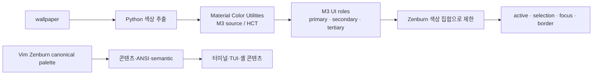
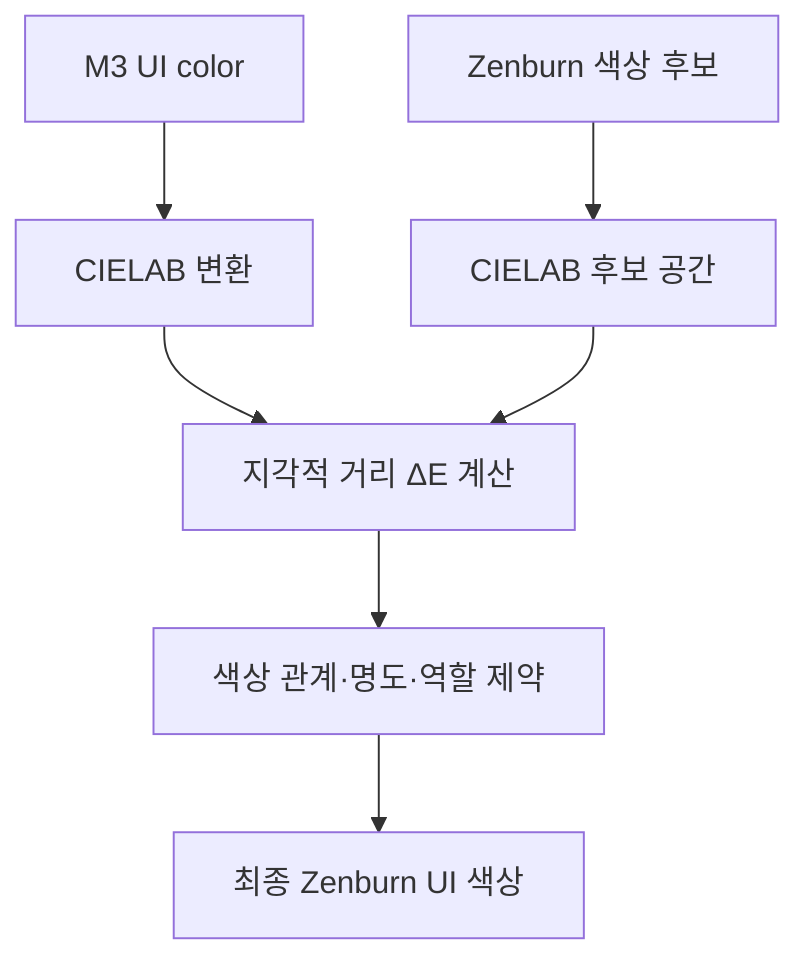
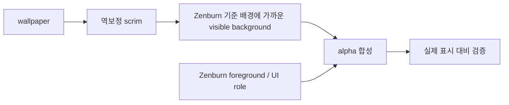
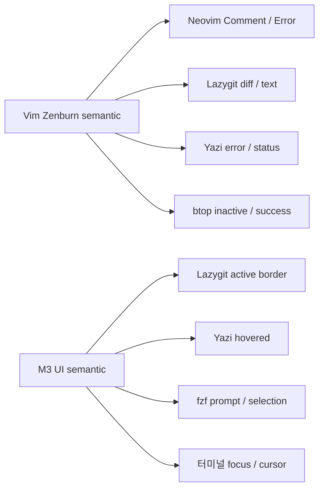
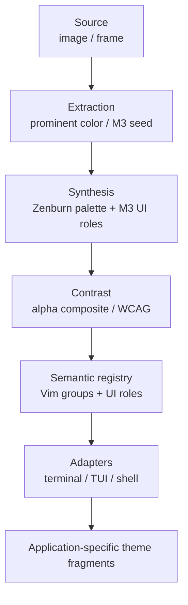

# Material Color Utilities와 Zenburn의 색상 설계 원리

> 환경: Python, Material Color Utilities, Vim Zenburn, 터미널·TUI·셸 애플리케이션

이 설계의 목적은 wallpaper 색상을 모든 애플리케이션에 그대로 복사하는 것이 아닙니다. wallpaper는 Material 3(M3) UI 색상의 seed로만 사용하고, 터미널 콘텐츠·ANSI·코드 구문 색상은 Vim Zenburn 팔레트에 고정합니다. 그 결과 배경화면이나 light/dark 상태가 바뀌어도 장시간 사용하는 텍스트 환경의 의미와 대비가 안정적으로 유지됩니다.

## 1. M3와 Zenburn의 역할 분리

색상 시스템은 콘텐츠와 UI chrome을 서로 다른 출처에서 만듭니다.



M3는 `primary`, `secondary`, `tertiary`와 `on`·`container` 관계를 통해 UI 상태의 차이를 만듭니다. 반면 `red`, `green`, `comment`, `error`, 문자열과 주석 같은 콘텐츠 semantic은 M3나 wallpaper에서 파생하지 않습니다.

이 경계를 지키면 다음 특성이 생깁니다.

- wallpaper가 바뀌어도 코드와 로그의 의미 색상이 변하지 않는다.
- light/dark 전환은 UI 표면 선택에만 영향을 주고 콘텐츠 팔레트는 유지된다.
- 모든 앱이 같은 Zenburn 바탕과 텍스트 계층을 공유한다.
- M3의 동적인 분위기와 Zenburn의 장시간 가독성을 동시에 얻는다.

## 2. 지각 기반 색상 양자화

M3가 계산한 raw HEX를 애플리케이션 설정에 직접 쓰지 않습니다. M3 UI 색상은 정식 Vim Zenburn 색상 집합 안에서 다시 선택합니다.



선택 기준은 단순한 RGB 숫자 차이가 아닙니다.

1. CIELAB 공간의 지각적 거리 `ΔE`
2. primary·secondary·tertiary 사이의 hue 순서와 명도 관계
3. active·selection·focus 역할에 적합한 명도 범위
4. 배경·본문·선택 영역 사이의 실제 대비

따라서 M3의 색상 관계는 보존하면서도 최종 출력은 Zenburn 팔레트로 제한됩니다. 특히 border와 selection background는 지나치게 밝은 색을 피하고, UI 텍스트는 Zenburn의 본문·muted 계층을 따릅니다.

## 3. 투명 합성과 대비의 원리

반투명 터미널에서는 설정 파일에 기록된 foreground와 background의 대비만으로 가독성을 판단할 수 없습니다. 실제 화면에서 보이는 배경은 wallpaper, scrim, surface opacity, compositor 효과가 합성된 결과이기 때문입니다.



색상 선택은 생성 후의 장식이 아니라 생성 과정의 제약입니다. 목표 대비를 만족하지 못하는 M3 색상은 그대로 출력하지 않고, 역할별 명도 제한과 CIELAB 거리를 함께 고려해 Zenburn 후보 중에서 다시 선택합니다.

원본 Zenburn의 comment·muted 계층은 낮은 대비를 의도한 의미 계층이므로 숫자만 보고 밝은 색으로 교체하지 않습니다. 본문 가독성, active·selection 분리, 배경과의 경계, 장시간 사용 피로도를 함께 평가해야 합니다.

## 4. Vim semantic의 애플리케이션 매핑

Vim highlight 그룹은 색상 이름 목록이 아니라 의미를 가진 canonical semantic source입니다. `Comment`, `Error`, `Visual`, `DiffAdd` 같은 그룹은 색상뿐 아니라 텍스트·선택 배경·오류·변경 상태라는 역할과 속성을 정의합니다.

앱마다 역할 이름은 다르므로 공통 semantic을 앱별 설정으로 역매핑합니다.



대표적인 관계는 다음과 같습니다.

```text
Neovim Comment       → vim.Comment          → Zenburn muted text
Lazygit diff_add     → vim.DiffAdd          → Zenburn success tone
zsh unknown-token    → vim.Error            → Zenburn error tone
Lazygit activeBorder → ui.primary            → Zenburn active border
Yazi hovered         → ui.primary_container  → Zenburn selection tone
```

`vim.*`은 콘텐츠 의미이고 `ui.*`는 M3에서 출발한 상호작용 의미입니다. 이 두 namespace를 분리하면 M3의 동적 색상이 코드의 문자열·주석·오류 의미를 침범하지 않습니다.

ANSI 0–15 슬롯은 semantic registry와 별도의 주소 체계로 유지합니다. Ghostty와 Kitty는 표준 ANSI 슬롯을 사용하고, Lazygit·Yazi·btop 같은 앱은 `vim.*` 또는 `ui.*` 역할을 사용합니다. ANSI 번호를 앱 semantic 역할로 재사용하지 않는 것이 핵심입니다.

## 5. 파이프라인 계층 분리

색상 과학과 플랫폼 설정을 분리하면 같은 의미 모델을 여러 애플리케이션에 재사용할 수 있습니다.



각 계층의 책임은 하나로 제한합니다.

- **Extraction**: 이미지에서 seed와 휘도 정보를 얻는다.
- **Synthesis**: M3 관계를 만들고 Zenburn 후보로 양자화한다.
- **Contrast**: 실제 합성 배경 위에서 역할별 대비를 검증한다.
- **Semantic registry**: Vim canonical 그룹과 M3 UI 역할을 앱 역할에 연결한다.
- **Adapter**: 공통 Palette를 Ghostty, Kitty, Neovim, Lazygit, Yazi, btop, zsh 등의 설정 형식으로 변환한다.

이 구조에서 플랫폼 adapter는 색상 의미를 다시 판단하지 않습니다. 코어가 결정한 `canvas`, `text`, `interaction`, `semantic`, `ansi` 모델만 소비하고 각 애플리케이션의 설정 문법으로 표현합니다. 따라서 앱이 달라져도 색상 선택의 근거와 semantic 의미는 동일하게 유지됩니다.
