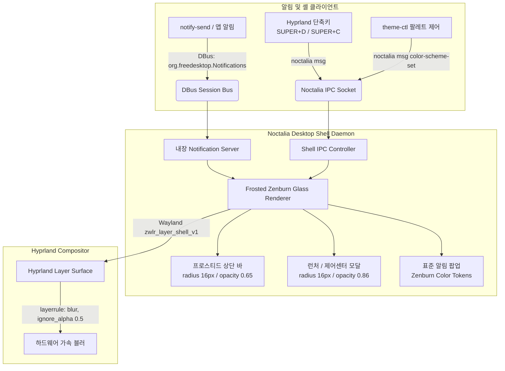

# Noctalia 데스크톱 셸 및 알림 일원화 치트시트

> 환경: Arch Linux x86_64, Linux 6.12+ zen, Hyprland, Noctalia Shell

Noctalia 데스크톱 셸은 기존의 Waybar(상단 바), Dunst/Mako(알림 데몬), 배경화면 데몬으로 분산되어 있던 Wayland 데스크톱 환경 요소를 단일 셸 프로세스로 통합합니다. Hyprland의 비스타일 OSD(`hyprctl notify`) 대신 FreeDesktop 표준 DBus 규격(`org.freedesktop.Notifications`)을 Noctalia 내장 데몬으로 일원화하여 수신하며, Frosted Zenburn Glass 디자인 시스템(16px Squircle 곡률, 0.86 반투명 아크릴 블러, 1px 45° 미세 엣지 반사광)을 시스템 전체 알림과 셸 UI에 동일하게 적용합니다.



시스템 앱이나 스크립트가 표준 알림을 발행하면 Session Bus를 통해 Noctalia가 수신하여 일관된 어스 톤 팔레트와 블러를 렌더링하고, Hyprland 레이어 규칙(`namespace = "^noctalia.*$"`)을 통해 하드웨어 가속 블러 처리를 거쳐 출력됩니다.

## 1. 패키지 설치

```shell
# 공식 저장소 필수 라이브러리 및 DBus 유틸리티 설치
sudo pacman -S --needed libnotify jq

# AUR 헬퍼를 통한 Noctalia 데스크톱 셸 설치
yay -S --needed noctalia-shell
```

## 2. 설정 파일

`~/.config/noctalia/config.toml`

상단 바, 알림 팝업, 런처 및 락스크린 위젯의 곡률과 불투명도를 Frosted Zenburn Glass 규격(바 투명도 0.65, 위젯 반경 16px)으로 선언합니다.

```toml
[bar.main]
radius = 16
border = "#ffffff28"
border_width = 1.0
background_opacity = 0.65
shadow = true
position = "top"
height = 36

[notifications]
enabled = true
radius = 16
opacity = 0.86
border_width = 1.0
border = "#ffffff28"
timeout = 5000
max_visible = 5
anchor = "top-right"
margin_top = 12
margin_right = 12

[launcher]
radius = 16
opacity = 0.86
border = "#ffffff28"
border_width = 1.0

[control_center]
radius = 16
opacity = 0.86
border = "#ffffff28"
border_width = 1.0

[lockscreen_widgets.widget."lockscreen-login-box@DP-1".settings]
background_radius = 16.0
input_radius = 10.0

[lockscreen_widgets.widget."lockscreen-login-box@eDP-1".settings]
background_radius = 16.0
input_radius = 10.0
```

`~/.config/noctalia/theme-colors.toml`

`theme-ctl` 및 Matugen 동적 파이프라인에서 생성되는 토큰 매핑 파일입니다.

```toml
[colors]
surface = "#3f3f3f"
surface_variant = "#4f4f4f"
on_surface = "#dcdccc"
outline = "#709080"
primary = "#60b48a"
on_primary = "#21322f"
warning = "#f0dfaf"
info = "#8cd0d3"
error = "#dca3a3"
```

`~/.config/hypr/hyprland.lua`

Noctalia 네임스페이스 레이어에 하드웨어 가속 블러를 적용하고, 세션 진입 시 Noctalia를 실행하여 알림 데몬과 상단 바를 일괄 구동합니다.

```lua
-- Noctalia 셸 레이어에 프로스티드 아크릴 블러 적용
hl.layer_rule({
  name = "noctalia-blur",
  match = { namespace = "^noctalia.*$" },
  blur = true,
  ignore_alpha = 0.5,
  blur_popups = true,
})

-- 세션 기동 시 Noctalia 단일 프로세스 실행
hl.on("hyprland.start", function()
  hl.exec_cmd("dbus-update-activation-environment --systemd --all")
  hl.exec_cmd("/usr/bin/noctalia")
end)

-- Noctalia UI 토글 단축키 매핑
local mainMod = "SUPER"
hl.bind(mainMod .. " + D", hl.dsp.exec_cmd("noctalia msg panel-toggle launcher"))
hl.bind(mainMod .. " + C", hl.dsp.exec_cmd("noctalia msg panel-toggle control-center"))
hl.bind(mainMod .. " + Escape", hl.dsp.exec_cmd("noctalia msg session lock"))
```

## 3. 서비스 실행 및 확인

```shell
# 1. Noctalia 데몬 수동 구동 테스트
noctalia &

# 2. FreeDesktop DBus 표준 알림 발송 테스트
notify-send "Noctalia 알림 테스트" "Frosted Zenburn Glass 디자인 시스템이 정상 적용되었습니다." -u normal

# 3. IPC를 통한 런처 및 제어센터 패널 토글 검증
noctalia msg panel-toggle launcher
noctalia msg panel-toggle control-center

# 4. 설정 핫 릴로드 테스트
noctalia msg config-reload
```

## 4. 트러블슈팅

!!! warning "다른 알림 데몬(Dunst, Mako, SwayNC)과의 DBus 소유권 충돌"
    `org.freedesktop.Notifications` 서비스는 버스당 단 하나의 프로세스만 점유할 수 있습니다. 기존의 Dunst나 Mako가 실행 중이면 Noctalia 내장 알림 수신기가 바인딩되지 않습니다. `killall dunst mako swaync`를 수행하거나 `~/.config/hypr/hyprland.lua`의 `exec-once` 목록에서 중복 데몬을 제거하십시오.

!!! warning "Hyprland 투명도 투과(Under-blur) 누락 문제"
    Noctalia 패널 또는 알림 창 뒤로 배경화면 블러가 흐려지지 않고 단순 검은색으로 보이는 경우, `~/.config/hypr/hyprland.lua`에 `hl.layer_rule`의 `namespace = "^noctalia.*$"` 및 `ignore_alpha = 0.5` 규칙이 정상 등록되었는지 확인하십시오.