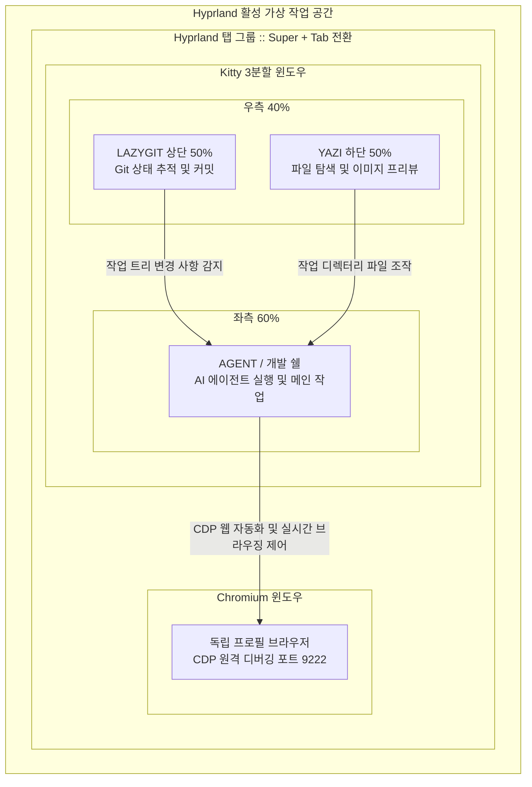

# cmux 대안 Hyprland 개발 환경 치트시트

> 환경: Arch Linux, Hyprland, Kitty, Lazygit, Yazi, Chromium (CDP)

`hyprmux`는 `cmux`의 워크플로우(터미널 분할창, 브라우저 프리뷰, AI 에이전트 브라우징 제어)를 리눅스 환경에 맞춰 재해석하고, **Google Antigravity CLI(`agy`)**를 중심으로 구동되는 Wayland/Hyprland 네이티브 경량 통합 개발 워크스페이스입니다.

무거운 일체형 일렉트론 애플리케이션 대신 리눅스의 각 최고 성능 도구(Hyprland, Kitty, Lazygit, Yazi, Chromium)를 표준 IPC(Unix 소켓, CDP, Wayland Dispatcher)로 유기적으로 결합합니다.



AI 에이전트와 사용자는 좌측 메인 쉘(`AGENT`)에서 코드를 조작하고, 우측 분할 영역(`LAZYGIT`, `YAZI`)에서 변경 사항과 파일 구조를 즉각 확인합니다. 동시에 백그라운드로 실행된 Chromium은 CDP(포트 9222)를 열어 에이전트가 브라우저를 직접 제어할 수 있게 하며, Hyprland 탭 그룹으로 묶여 단축키 하나로 터미널과 브라우저 화면을 전환합니다.

| 구성 요소 | 역할 | 연동 방식 |
| --- | --- | --- |
| `Hyprland` | 윈도우 레이아웃 및 탭 그룹화 | `hyprctl dispatch` IPC로 Kitty와 Chromium을 단일 탭 그룹으로 병합 (`Super + Tab`) |
| `Kitty` | 고성능 터미널 3분할 멀티플렉싱 | `splits` 레이아웃 및 Unix 소켓(`/tmp/hyprmux.sock`) 기반 원격 제어 |
| `AGENT` (좌측 60%) | AI 코딩 에이전트 쉘 & 메인 개발 콘솔 | `agy`(Antigravity CLI) 실행 및 빌드/테스트 메인 콘솔 |
| `LAZYGIT` (우측 상단 20%) | Git 워크트리 변경 추적 및 커밋 관리 | 변경 파일의 실시간 diff 시각화 및 키 입력 기반 스테이징 |
| `YAZI` (우측 하단 20%) | 고속 파일 트리 탐색 및 에셋 프리뷰 | 비동기 I/O 파일 관리, 텍스트 및 이미지 인라인 미리보기 |
| `Chromium` | AI 에이전트 웹 브라우징 & 라이브 프리뷰 | 독립 프로필(`~/.config/chromium-hyprmux`)과 CDP 포트(9222) 원격 제어 |

## 1. 패키지 설치

```shell
sudo pacman -Syu hyprland kitty lazygit yazi chromium jq
```

## 2. 설정 파일

`~/.config/kitty/hyprmux.session`

Kitty 터미널의 3분할(좌측 60% 개발 쉘, 우측 상단 20% Lazygit, 우측 하단 20% Yazi) 레이아웃을 정의합니다.

```ini
layout splits

# 좌측 60%: 메인 에이전트/개발 쉘
launch --location=vsplit --bias=60 --title="AGENT"

# 우측 40% 상단 (50%): lazygit (스마트 Git 런처 적용)
launch --location=vsplit --bias=40 --title="LAZYGIT" hyprmux-lazygit

# 우측 40% 하단 (50%): yazi (우측 lazygit 공간에서 수평 분할)
launch --location=hsplit --bias=50 --title="YAZI" yazi

# 시작 포커스는 메인 에이전트 창으로 맞춤
focus_matching_window title:^AGENT$
```

`~/bin/hyprmux-lazygit`

Git 저장소 외부에서 Lazygit이 즉시 오류를 내며 종료되지 않도록 주변 Git 프로젝트를 탐색해 선택할 수 있는 래퍼 스크립트입니다. 실행 권한(`chmod +x`)을 부여합니다.

```bash
#!/usr/bin/env bash
export PATH="$HOME/bin:$HOME/.local/bin:$PATH"

is_git_repo() {
    git rev-parse --is-inside-work-tree >/dev/null 2>&1
}

if is_git_repo; then
    exec lazygit
fi

while ! is_git_repo; do
    clear
    echo -e "\033[38;2;96;180;138m🌿 [hyprmux :: lazygit]\033[0m"
    echo -e "\033[38;2;220;220;204m현재 위치:\033[0m \033[38;2;140;208;211m$(pwd)\033[0m \033[38;2;223;175;143m(Git 저장소 아님)\033[0m"
    echo -e "\033[38;2;112;144;128m─────────────────────────────────────────────────\033[0m"

    REPOS=()
    while IFS= read -r repo; do
        if [ -n "$repo" ] && [ "$repo" != "$HOME" ] && git -C "$repo" rev-parse --is-inside-work-tree >/dev/null 2>&1; then
            REPOS+=("$repo")
        fi
    done < <(find "$HOME/workspace" "$HOME" -maxdepth 3 -name ".git" -type d 2>/dev/null | sed 's|/\.git$||' | sort -u | head -n 6)

    if [ ${#REPOS[@]} -gt 0 ]; then
        echo -e "\033[38;2;240;222;174m발견된 Git 프로젝트:\033[0m"
        for i in "${!REPOS[@]}"; do
            echo -e "  \033[38;2;96;180;138m[$((i+1))]\033[0m ${REPOS[$i]}"
        done
        echo -e "\033[38;2;112;144;128m─────────────────────────────────────────────────\033[0m"
        echo -e "번호 \033[38;2;96;180;138m[1-${#REPOS[@]}]\033[0m을 누르면 해당 프로젝트의 lazygit으로 시작합니다."
        echo -e "\033[38;2;140;208;211m[Enter]\033[0m를 누르면 프로젝트 이동용 쉘로 진입합니다."
        read -r -n 1 -p "선택: " choice
        echo ""

        if [[ "$choice" =~ ^[1-9]$ ]] && [ "$choice" -le "${#REPOS[@]}" ]; then
            target="${REPOS[$((choice-1))]}"
            cd "$target" || true
            exec lazygit
        else
            break
        fi
    else
        echo -e "프로젝트 디렉터리로 이동(cd) 후 lazygit을 실행하세요."
        break
    fi
done

exec bash
```

`~/bin/hyprmux`

단일 명령으로 CDP 활성화 Chromium을 실행하고, Kitty 3분할 세션을 열거나 기존 터미널을 인플레이스(In-Place) 전환한 뒤, Hyprland IPC를 호출해 두 창을 활성 작업 공간에서 탭 그룹으로 병합합니다. 실행 권한(`chmod +x`)을 부여합니다.

```bash
#!/usr/bin/env bash
export PATH="$HOME/bin:$HOME/.local/bin:$PATH"

if [ "$1" = "stop" ] || [ "$1" = "kill" ] || [ "$1" = "--stop" ]; then
    exec "$HOME/bin/hyprmux-stop"
fi

TARGET_DIR="$PWD"
if [ -n "$1" ] && [ -d "$1" ]; then
    TARGET_DIR=$(realpath "$1")
fi

if ! git -C "${TARGET_DIR}" rev-parse --is-inside-work-tree >/dev/null 2>&1; then
    echo -e "\033[31m[hyprmux] 오류: '${TARGET_DIR}'은(는) Git 저장소가 아닙니다.\033[0m" >&2
    exit 1
fi

WORK_DIR=$(git -C "${TARGET_DIR}" rev-parse --show-toplevel)
cd "${WORK_DIR}" || exit 1

CHROME_PROFILE="$HOME/.config/chromium-hyprmux"
CDP_PORT=9222
KITTY_SOCK="/tmp/hyprmux.sock"
KITTY_SESSION="$HOME/.config/kitty/hyprmux.session"

# 1. Chromium CDP 백그라운드 구동
if ! curl -s "http://127.0.0.1:${CDP_PORT}/json/version" >/dev/null 2>&1; then
    mkdir -p "${CHROME_PROFILE}"
    nohup chromium \
        --remote-debugging-port="${CDP_PORT}" \
        --remote-allow-origins="*" \
        --user-data-dir="${CHROME_PROFILE}" \
        --no-first-run \
        --no-default-browser-check \
        --password-store=basic \
        about:blank </dev/null >/dev/null 2>&1 &

    while ! curl -s "http://127.0.0.1:${CDP_PORT}/json/version" >/dev/null 2>&1; do
        sleep 0.1
    done
fi

# 2. Kitty 터미널 환경 구성 (기존 터미널 인플레이스 전환 또는 신규 실행)
if [ -n "${KITTY_WINDOW_ID}" ] && kitty @ ls >/dev/null 2>&1; then
    kitty @ goto-layout splits 2>/dev/null || true
    kitty @ set-window-title --match="id:${KITTY_WINDOW_ID}" "AGENT" 2>/dev/null || true
    CURRENT_WINDOWS=$(kitty @ ls 2>/dev/null | jq -r '.[0].tabs[0].windows[] | .title')

    if ! echo "${CURRENT_WINDOWS}" | grep -q "^LAZYGIT$"; then
        kitty @ launch --location=vsplit --bias=40 --title="LAZYGIT" --cwd="${WORK_DIR}" lazygit 2>/dev/null || true
    fi
    if ! echo "${CURRENT_WINDOWS}" | grep -q "^YAZI$"; then
        kitty @ launch --location=hsplit --bias=50 --title="YAZI" --cwd="${WORK_DIR}" yazi 2>/dev/null || true
    fi
    kitty @ focus-window --match="id:${KITTY_WINDOW_ID}" 2>/dev/null || true
elif ! kitty @ --to="unix:${KITTY_SOCK}" ls >/dev/null 2>&1; then
    nohup kitty --directory="${WORK_DIR}" --listen-on="unix:${KITTY_SOCK}" --session="${KITTY_SESSION}" </dev/null >/dev/null 2>&1 &
fi

# 3. Hyprland 탭 그룹화 동기화
python3 -c '
import json, subprocess, time, sys, os

try:
    ws_raw = subprocess.check_output(["hyprctl", "activeworkspace", "-j"], stderr=subprocess.DEVNULL).decode("utf-8")
    target_ws = json.loads(ws_raw).get("id", 1)
except Exception:
    target_ws = 1

def is_hyprmux_chrome(client):
    if "chromium" not in client.get("class", "").lower():
        return False
    pid = client.get("pid")
    if not pid:
        return False
    try:
        with open(f"/proc/{pid}/cmdline", "rb") as f:
            return "chromium-hyprmux" in f.read().decode("utf-8", errors="ignore")
    except Exception:
        return False

for _ in range(35):
    try:
        clients = json.loads(subprocess.check_output(["hyprctl", "clients", "-j"], stderr=subprocess.DEVNULL).decode("utf-8"))
    except Exception:
        clients = []

    ws_kitties = [c for c in clients if c.get("class") == "kitty" and c.get("workspace", {}).get("id") == target_ws]
    ws_chromes = [c for c in clients if is_hyprmux_chrome(c) and c.get("workspace", {}).get("id") == target_ws]

    if ws_kitties and ws_chromes:
        k_win, c_win = ws_kitties[0], ws_chromes[0]
        k_addr, c_addr = k_win["address"], c_win["address"]
        if c_addr in k_win.get("grouped", []):
            sys.exit(0)

        if not k_win.get("grouped", []):
            subprocess.run(["hyprctl", "dispatch", f"hl.dsp.focus({{ window = \"address:{k_addr}\" }})"], stdout=subprocess.DEVNULL)
            subprocess.run(["hyprctl", "dispatch", "hl.dsp.group.toggle()"], stdout=subprocess.DEVNULL)
            time.sleep(0.15)

        subprocess.run(["hyprctl", "dispatch", f"hl.dsp.focus({{ window = \"address:{c_addr}\" }})"], stdout=subprocess.DEVNULL)
        time.sleep(0.15)
        direction = "left" if c_win.get("at", [0, 0])[0] >= k_win.get("at", [0, 0])[0] else "right"
        subprocess.run(["hyprctl", "dispatch", f"hl.dsp.window.move({{ into_group = \"{direction}\" }})"], stdout=subprocess.DEVNULL)
        time.sleep(0.15)
        subprocess.run(["hyprctl", "dispatch", f"hl.dsp.focus({{ window = \"address:{k_addr}\" }})"], stdout=subprocess.DEVNULL)
        sys.exit(0)
    time.sleep(0.1)
' || true
```

`~/bin/hyprmux-stop`

세션을 종료하고 개인 브라우저는 건드리지 않은 채 hyprmux 전용 프로세스와 포트를 안전하게 정리합니다. 실행 권한(`chmod +x`)을 부여합니다.

```bash
#!/usr/bin/env bash
export PATH="$HOME/bin:$HOME/.local/bin:$PATH"

KITTY_SOCK="/tmp/hyprmux.sock"
CDP_PORT=9222

# 1. Kitty 세션 정상 종료
if [ -S "${KITTY_SOCK}" ]; then
    kitty @ --to="unix:${KITTY_SOCK}" quit >/dev/null 2>&1 || true
    sleep 0.2
fi

# 2. hyprmux 전용 Chromium 프로세스만 종료 (개인 브라우저 보존)
for pid in $(pgrep -f "chromium" 2>/dev/null); do
    if [ -f "/proc/${pid}/cmdline" ]; then
        cmd=$(tr '\0' ' ' < "/proc/${pid}/cmdline" 2>/dev/null || true)
        if echo "${cmd}" | grep -q "chromium-hyprmux"; then
            kill -TERM "${pid}" 2>/dev/null || true
        fi
    fi
done

# 3. 디버깅 포트 및 소켓 해제
fuser -k "${CDP_PORT}/tcp" >/dev/null 2>&1 || true
rm -f "${KITTY_SOCK}"

# 4. Hyprland 알림
if command -v hyprctl >/dev/null 2>&1; then
    hyprctl notify 1 2000 "rgb(93e0e3)" "hyprmux: All Daemons Stopped" >/dev/null 2>&1 || true
fi
```

`~/.config/hypr/hyprland.conf`

Hyprland에서 탭 그룹 창을 손쉽게 전환할 수 있도록 키바인딩을 지정합니다.

```ini
# 그룹 내 다음 탭으로 순환
bind = $mainMod, Tab, changegroupactive, f
# 그룹 내 이전 탭으로 순환
bind = $mainMod SHIFT, Tab, changegroupactive, b

# 탭 그룹 토글
bind = $mainMod, G, togglegroup
```

## 3. 서비스 실행 및 확인

### 3.1 세션 기동 방식

`hyprmux`는 실행 위치와 현재 터미널 상태에 따라 자동으로 최적의 모드로 진입합니다.

```shell
cd ~/workspace/my-project
hyprmux
```

1. **신규 실행 모드**: 터미널 외부 또는 새 작업 공간에서 실행 시, `~/.config/kitty/hyprmux.session`을 읽어 Kitty 3분할 윈도우를 띄우고 Chromium CDP 인스턴스를 실행하여 활성 작업 공간에서 자동으로 탭 그룹으로 결합합니다.
2. **인플레이스 전환(In-Place Transformation) 모드**: 이미 작업 중이던 Kitty 터미널 안에서 `hyprmux`를 입력하면, 새로운 창을 띄우지 않고 현재 윈도우를 좌측 60% `AGENT`로 재설정하며 우측에 `LAZYGIT`과 `YAZI` 패널을 즉각 분할 생성합니다.

### 3.2 일상 개발 워크플로우

`hyprmux` 환경이 활성화되면 세 개의 터미널 영역과 브라우저가 다음과 같이 상호보완적으로 동작합니다.

1. **에이전트 작업 (`AGENT`)**: 좌측 메인 쉘에서 `agy`(Antigravity CLI)를 실행하여 코드 작성, 리팩터링, 테스트 명령을 지시합니다.
2. **파일 탐색 및 검토 (`YAZI`)**: 에이전트가 새로 생성한 파일이나 이미지 에셋을 우측 하단 Yazi에서 방향키로 빠르게 이동하며 미리보기합니다.
3. **변경점 추적 및 커밋 (`LAZYGIT`)**: 에이전트가 파일들을 수정한 즉시 우측 상단 Lazygit에 변경 내역(diff)이 실시간으로 갱신됩니다. 에이전트 작업 완료 후 `Space`로 스테이징하고 `c`로 즉시 체크포인트 커밋을 남깁니다.
4. **브라우저 화면 검증 (`Chromium`)**: `$mainMod + Tab`을 누르면 Kitty 3분할 창에서 Chromium 브라우저로 즉각 화면이 전환되어 개발 중인 웹 UI를 검증할 수 있습니다.

### 3.3 AI 에이전트의 브라우저 제어 (CDP 연동)

Chromium이 열어둔 9222 포트는 에이전트가 브라우저를 프로그래밍 방식으로 조작할 수 있는 원격 엔드포인트입니다.

엔드포인트 응답 상태 확인:

```shell
curl -s http://127.0.0.1:9222/json/version
```

정상 응답 예시:

```json
{
   "Browser": "Chrome/133.0.0.0",
   "Protocol-Version": "1.3",
   "User-Agent": "Mozilla/5.0 ...",
   "V8-Version": "...",
   "webSocketDebuggerUrl": "ws://127.0.0.1:9222/devtools/browser/..."
}
```

Python 스크립트나 AI 에이전트 툴체인(Playwright)에서 실행 중인 브라우저에 연결하는 예시:

```python
from playwright.sync_api import sync_playwright

with sync_playwright() as p:
    browser = p.chromium.connect_over_cdp("http://127.0.0.1:9222")
    context = browser.contexts[0]
    page = context.new_page()
    page.goto("http://localhost:3000")
    page.screenshot(path="screenshot.png")
```

### 3.4 주요 단축키 및 환경 조작

`hyprmux` 환경은 Hyprland 윈도우 매니저, Kitty 터미널 멀티플렉서, TUI 생산성 도구의 3단계 계층으로 제어됩니다.

#### 1) Hyprland 창 관리 및 hyprmux 탭 그룹 (`$mainMod = SUPER`)

| 단축키 | 명령/동작 | 기능 설명 |
| --- | --- | --- |
| `$mainMod + Tab` | `hl.dsp.group.next()` | **Kitty 3분할 터미널 ↔ Chromium 브라우저** 탭 순환 전환 |
| `$mainMod + Shift + Tab` | `hl.dsp.group.prev()` | 탭 그룹 내 이전 창으로 역방향 순환 |
| `$mainMod + G` | `hl.dsp.group.toggle()` | 활성 창 탭 그룹 결합 또는 그룹 해제 |
| `$mainMod + Shift + G` | `hl.dsp.window.move({ into_group = "left" })` | 현재 창을 왼쪽 탭 그룹으로 강제 편입 |
| `$mainMod + Shift + D` | `exec, hyprmux-stop` | **hyprmux 세션 전체 종료** (Chromium CDP, 소켓, 프로세스 정리) |
| `$mainMod + H / J / K / L` | `hl.dsp.focus({ direction = ... })` | Vim 스타일 활성 윈도우 포커스 이동 (좌 / 하 / 상 / 우) |
| `$mainMod + F` | `hl.dsp.window.fullscreen()` | 활성 창 전체 화면 토글 |
| `$mainMod + Space` | `hl.dsp.window.float()` | 타일링 / 플로팅 윈도우 전환 토글 |
| `$mainMod + Q` | `hl.dsp.window.kill()` | 활성 윈도우 닫기 |
| `$mainMod + 1 ~ 3` | `hl.dsp.focus({ workspace = ... })` | 가상 작업 공간(Workspace) 1~3 바로 이동 |

#### 2) Kitty 터미널 3분할 멀티플렉싱 (`Ctrl + Shift`)

| 단축키 | 기능 설명 |
| --- | --- |
| `Ctrl + Shift + [` | 이전 분할 패널로 포커스 이동 (`AGENT` ← `LAZYGIT` ← `YAZI`) |
| `Ctrl + Shift + ]` | 다음 분할 패널로 포커스 이동 (`AGENT` → `LAZYGIT` → `YAZI`) |
| `Ctrl + Shift + Z` | **스택 줌(Stack/Zoom) 토글**: 현재 패널을 터미널 전체로 확대 / 복귀 (에이전트 코드 집중) |
| `Ctrl + Shift + R` | 분할 패널 크기 조절(Resize) 모드 진입 (방향키로 조절 후 `Esc`로 완료) |
| `Ctrl + Shift + L` | 레이아웃 순환 (`splits` ↔ `stack` ↔ `tall` ↔ `fat` ↔ `grid`) |
| `Ctrl + Shift + Enter` | 현재 레이아웃에서 새 분할 쉘 추가 |
| `Ctrl + Shift + W` | 현재 분할 패널 닫기 |
| `Ctrl + Shift + C` / `V` | 터미널 텍스트 복사 / 붙여넣기 |
| `Ctrl + Shift + Page_Up` / `Down` | 터미널 출력 버퍼 이전 / 다음 페이지 스크롤 |

#### 3) TUI 도구 (Lazygit & Yazi) 핵심 조작키

| 도구 | 단축키 | 기능 설명 |
| --- | --- | --- |
| **Lazygit**<br/>(우측 상단 20%) | `Space` | 파일 스테이징 / 언스테이징 토글 |
| | `c` | Git 커밋 메시지 작성 |
| | `P` / `p` | 원격 저장소 푸시(Push) / 풀(Pull) |
| | `d` | 변경 사항 폐기(Discard / Reset) |
| | `z` | 직전 Git 작업 실행 취소(Undo) |
| | `1` ~ `5` | 메인 패널 전환 (1: 상태, 2: 파일, 3: 브랜치, 4: 커밋, 5: 스태시) |
| | `q` | Lazygit 종료 (Git 저장소 미감지 시 스마트 런처로 복귀) |
| **Yazi**<br/>(우측 하단 20%) | `h` / `j` / `k` / `l` | 디렉터리 상위 이동 / 아래 / 위 / 진입 또는 파일 열기 (방향키 호환) |
| | `Space` | 파일 다중 선택 토글 |
| | `y` / `x` / `p` | 파일 복사(Yank) / 잘라내기(Cut) / 붙여넣기(Paste) |
| | `d` | 파일 삭제 (시스템 휴지통 이동) |
| | `.` (마침표) | 숨김 파일(Hidden files) 표시 토글 |
| | `q` | Yazi 종료 |

### 3.5 세션 종료 및 정리

개발 작업을 마치면 단일 명령으로 hyprmux 관련 프로세스만 안전하게 정리합니다.

```shell
hyprmux stop
```

실행 중인 개인 브라우저 프로세스는 건드리지 않고, `/tmp/hyprmux.sock` 소켓, 9222 CDP 포트, hyprmux 전용 Chromium 인스턴스만 종료한 후 Hyprland 데스크톱 알림을 띄웁니다.

## 4. 트러블슈팅

!!! warning
    Chromium을 실행할 때 `--user-data-dir`를 분리하지 않으면 이미 실행 중인 개인 Chromium 브라우저 프로세스에 탭만 추가되어 `--remote-debugging-port` 옵션이 무시됩니다. 반드시 `~/.config/chromium-hyprmux`와 같이 독립된 프로필 디렉터리를 지정해야 에이전트 자동화용 CDP 포트가 열립니다.

!!! warning
    포트 9222가 이미 다른 디버거 프로세스에 의해 점유되어 있거나 비정상 종료 후 남아있는 경우 `curl -s http://127.0.0.1:9222/json/version` 응답이 실패할 수 있습니다. `fuser -k 9222/tcp`로 포트를 회수한 뒤 `hyprmux`를 재실행합니다.

!!! warning
    기존 실행 중인 Kitty 터미널 안에서 `hyprmux`를 실행할 때 인플레이스 창 분할이 동작하려면 `~/.config/kitty/kitty.conf`에 `allow_remote_control yes` 또는 `allow_remote_control socket-only` 설정이 켜져 있어야 합니다.
