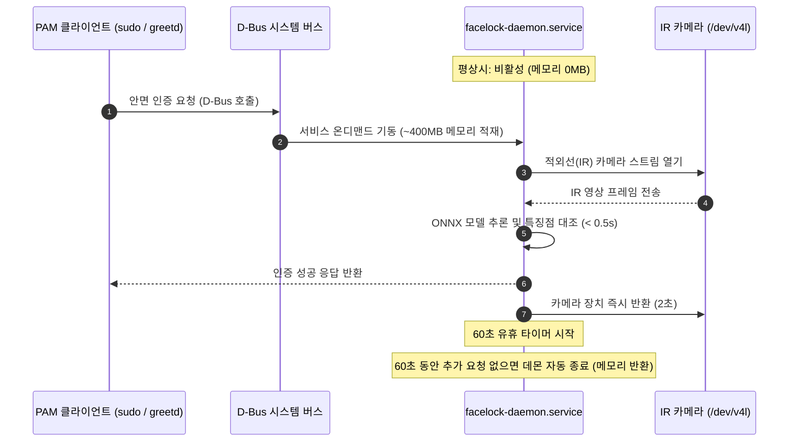

# Facelock 온디맨드 안면 인증 치트시트

> 환경: Arch Linux, systemd, D-Bus, acpid, Facelock, V4L2 IR 카메라

## 1. 패키지 설치

```shell
sudo pacman -Syu acpid v4l-utils onnxruntime-cpu
# AUR에서 facelock 바이너리 패키지 설치
yay -S facelock-bin
```

Facelock은 ONNX 런타임을 통해 안면 특징점을 추출하고 대조한다. CPU 환경에 최적화된 실행을 위해 `onnxruntime` 제공자로 `onnxruntime-cpu`를 지정한다.

## 2. 설정 파일

기존 상주형 얼굴 인증 데몬(`visaged`)은 약 400MB에 달하는 ONNX 모델과 런타임을 상시 메모리에 상주시켜 시스템 메모리를 지속해서 점유한다. Facelock은 D-Bus 시스템 서비스 활성화와 유휴 시간 초과(`idle_timeout_secs = 60`) 설정을 제공한다.

인증 요청(PAM: `sudo`, `greetd`, 잠금 화면 등)이 전달되면 D-Bus 신호에 의해 `facelock-daemon.service`가 온디맨드로 기동되어 메모리에 적재된다. 0.5초 이내에 안면 인식을 완료하고, 인증 직후 카메라 장치를 해제(`camera_release_after_success_secs = 2`)한다. 마지막 인증 후 60초 동안 추가 요청이 없으면 데몬 프로세스가 자동 종료되어 점유하던 400MB 메모리를 시스템에 반환한다.



노트북 덮개(Lid) 상태에 따라 외장 IR 카메라(도킹/클램셸 모드)와 내장 IR 카메라(열림 모드)를 동적으로 전환한다. 전환 스크립트는 `/etc/facelock/config.toml`의 카메라 경로를 원자적으로 갱신하며, 데몬이 실행 중일 때만 `systemctl try-restart`를 호출해 불필요하게 유휴 데몬을 깨우지 않는다.

`/etc/udev/rules.d/70-facelock-cameras.rules`

```udev
# Facelock IR 카메라 고정 심볼릭 링크 규칙
# 듀얼 스트림 웹캠의 RGB(interface 00)와 IR(interface 02) 간 udev 경합 방지

# 외장 IR 카메라 (Interface 02)
SUBSYSTEM=="video4linux", KERNEL=="video*", ATTR{index}=="0", ENV{ID_VENDOR_ID}=="17ef", ENV{ID_MODEL_ID}=="4839", ENV{ID_USB_INTERFACE_NUM}=="02", SYMLINK+="v4l/by-id/lenovo-external-ir"

# 내장 IR 카메라 (Interface 02)
SUBSYSTEM=="video4linux", KERNEL=="video*", ATTR{index}=="0", ENV{ID_VENDOR_ID}=="3277", ENV{ID_MODEL_ID}=="0060", ENV{ID_USB_INTERFACE_NUM}=="02", SYMLINK+="v4l/by-id/shinetech-internal-ir"
```

`/etc/facelock/config.toml`

```toml
[device]
path = "/dev/v4l/by-id/lenovo-external-ir"

[recognition]
execution_provider = "cpu"

[daemon]
mode = "daemon"
idle_timeout_secs = 60
camera_release_after_success_secs = 2

[security]
# 덮개가 닫힌 상태에서도 외장 IR 카메라 인증 허용
abort_if_lid_closed = false
abort_if_ssh = false
require_ir = true
bind_templates_to_device = true

[encryption]
method = "keyfile"

[notification]
mode = "terminal"
notify_on_failure = false
```

`/usr/local/bin/facelock-lid-switch`

```python
#!/usr/bin/env python3
"""리드 상태에 따라 적절한 IR 카메라를 선택하고 데몬 실행 시에만 설정을 갱신합니다."""
import fcntl
import glob
import os
from pathlib import Path
import re
import subprocess
import sys
import tempfile
import tomllib

EXTERNAL_CANDIDATES = [
    "/dev/v4l/by-id/lenovo-external-ir",
    "/dev/v4l/by-path/pci-0000:00:14.0-usb-0:1.4.2.1.3:1.2-video-index0",
]

INTERNAL_CANDIDATES = [
    "/dev/v4l/by-id/shinetech-internal-ir",
    "/dev/v4l/by-path/pci-0000:00:14.0-usb-0:9:1.2-video-index0",
]


def resolve_camera(candidates):
    for candidate in candidates:
        if Path(candidate).exists():
            return candidate
    return candidates[0]


def select_camera(closed):
    external = resolve_camera(EXTERNAL_CANDIDATES)
    internal = resolve_camera(INTERNAL_CANDIDATES)

    # 덮개 닫힘: 외장 IR 사용 / 덮개 열림: 내장 IR 우선
    preferred = external if closed else internal
    if Path(preferred).exists():
        return preferred
    if not closed and Path(external).exists():
        return external
    return preferred


def update_config(text, selected):
    pattern = r'(?ms)(^\[device\][^\n]*\n)(.*?)(?=^\[|\Z)'
    section = re.search(pattern, text)
    if not section:
        raise ValueError("Missing [device] section")
    body = section.group(2)
    setting = f'path = "{selected}"'
    if re.search(r"(?m)^path\s*=", body):
        body = re.sub(r"(?m)^path\s*=.*$", setting, body)
    else:
        body = setting + "\n" + body
    result = text[:section.start(2)] + body + text[section.end(2):]
    tomllib.loads(result)
    return result


def main():
    if os.geteuid() != 0:
        raise SystemExit("Run as root")

    closed = any("closed" in Path(p).read_text()
                 for p in glob.glob("/proc/acpi/button/lid/*/state"))

    path = Path("/etc/facelock/config.toml")
    with open("/run/facelock-camera.lock", "a") as lock:
        fcntl.flock(lock, fcntl.LOCK_EX)
        original = path.read_text()
        result = update_config(original, select_camera(closed))
        if result == original:
            return

        descriptor, temporary = tempfile.mkstemp(prefix=".camera-", dir=path.parent)
        try:
            with os.fdopen(descriptor, "w") as output:
                output.write(result)
                output.flush()
                os.fsync(output.fileno())
            os.chmod(temporary, 0o644)
            os.replace(temporary, path)
        finally:
            if os.path.exists(temporary):
                os.unlink(temporary)

        # 데몬이 현재 실행 중일 때만 재시작하여 온디맨드 유휴 상태 유지
        subprocess.run(["systemctl", "try-restart", "facelock-daemon.service"], check=False)


if __name__ == "__main__":
    main()
```

`/etc/acpi/events/lm-lid`

```ini
event=button/lid.*
action=/usr/local/bin/facelock-lid-switch
```

`/etc/systemd/system/check-lid-on-boot.service`

```ini
[Unit]
Description=Select Facelock IR camera before login
Before=greetd.service display-manager.service
After=systemd-udevd.service

[Service]
Type=oneshot
ExecStart=/usr/local/bin/facelock-lid-switch

[Install]
WantedBy=graphical.target
```

`/etc/pam.d/sudo`

```pam
auth       sufficient   pam_facelock.so
auth       include      system-auth
```

`/etc/pam.d/greetd`

```pam
auth       sufficient   pam_facelock.so
auth       include      system-local-login
```

## 3. 서비스 실행 및 확인

```shell
# 1. Facelock 기본 설정 초기화 (CPU 프로바이더 및 키파일 암호화)
sudo facelock setup --non-interactive --no-pam --no-systemd --no-enroll \
  --models standard --execution-provider cpu --encryption keyfile

# 2. udev 규칙 적용 및 초기 카메라 선택
sudo install -m644 /etc/udev/rules.d/70-facelock-cameras.rules /etc/udev/rules.d/
sudo udevadm control --reload-rules && sudo udevadm trigger -s video4linux
sudo chmod 755 /usr/local/bin/facelock-lid-switch
sudo /usr/local/bin/facelock-lid-switch

# 3. 안면 데이터 등록 (외장 IR 카메라 기준)
sudo facelock enroll --user $USER --label external-ir
# 인증 확인 (정상 일치 시 종료 코드 0)
sudo facelock auth --user $USER

# 4. 기존 상주형 visaged 데몬 비활성화 및 마스킹 (메모리 누수 방지)
sudo systemctl disable --now visaged.service visage-resume.service
sudo systemctl mask visaged.service visage-resume.service

# 5. Facelock 온디맨드 데몬 및 부팅/ACPI 서비스 활성화
sudo systemctl unmask facelock-daemon.service
sudo systemctl daemon-reload
sudo systemctl enable --now acpid.service check-lid-on-boot.service
```

온디맨드 D-Bus 기동과 60초 자동 메모리 반환 검증:

```shell
# PAM을 통한 sudo 인증 테스트 (카메라를 응시)
sudo -k && sudo /usr/bin/true

# 인증 직후 데몬 상태 확인: D-Bus 신호로 활성화되어 RSS ~400MB 점유 확인
systemctl status facelock-daemon.service

# 60초 경과 후 데몬 프로세스 자동 종료 및 메모리 반환 확인 (inactive 상태)
sleep 65
systemctl status facelock-daemon.service
```

## 4. 트러블슈팅

!!! warning
    `facelock-daemon.service`가 masked 상태이면 PAM 인증 시 D-Bus 서비스가 데몬을 기동하지 못하고 타임아웃 오류가 발생한다. `systemctl is-enabled facelock-daemon.service`를 점검하고 필요시 `sudo systemctl unmask facelock-daemon.service`를 실행한다.

!!! warning
    듀얼 스트림 웹캠(RGB와 IR 동시 지원)은 인터페이스 번호 경합으로 IR 대신 RGB 장치가 연결될 수 있다. `udevadm info -a /dev/videoN` 명령어로 IR 카메라의 `ID_USB_INTERFACE_NUM`이 `02`인지 확인하고 `70-facelock-cameras.rules`의 속성과 일치시킨다.

!!! warning
    노트북 덮개가 닫힌 클램셸 모드에서 외장 IR 카메라가 연결되어 있지 않은 경우, 잠금 해제가 차단되지 않아야 한다. PAM 파일(`/etc/pam.d/sudo`, `/etc/pam.d/greetd`)에서 `pam_facelock.so` 뒤에 반드시 기존 비밀번호 인증 체인(`auth include ...`)이 유지되어야 한다.

!!! warning
    PAM 설정을 변경할 때는 오타나 모듈 누락으로 인한 잠김 방지를 위해 별도의 루트 셸 세션을 열어둔 상태에서 `sudo -k && sudo true`로 검증을 마친 후 터미널을 닫아야 한다.
