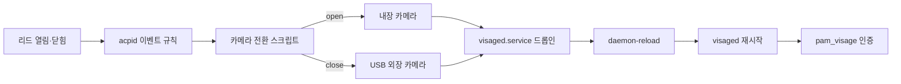

# 리드 상태 기반 Visage 카메라 전환 치트시트

> 환경: Arch Linux, systemd, acpid, Visage, V4L2 카메라

## 1. 패키지 설치

```shell
sudo pacman -Syu acpid v4l-utils
# AUR에서 선택한 Visage 패키지 설치
yay -S visage-bin
```

`v4l2-ctl --list-devices`와 `/dev/v4l/by-id/`로 카메라를 확인한다. `/dev/videoN`은 부팅·연결 순서에 따라 달라질 수 있으므로, 스크립트에는 안정적인 `/dev/v4l/by-id/` 심볼릭 링크를 사용한다.

## 2. 설정 파일

리드 이벤트가 발생하면 `acpid`가 스크립트를 호출한다. 스크립트는 열림이면 내장 카메라, 닫힘이면 USB 외장 카메라를 선택하고 `visaged`의 systemd 드롭인을 갱신한다. 이후 데몬을 다시 시작해 새 `VISAGE_CAMERA_DEVICE` 값을 적용한다.



카메라 선택은 인증 요청마다 수행하지 않는다. 리드 상태가 바뀔 때만 데몬의 카메라 장치를 전환하므로, PAM 모듈은 계속 실행 중인 `visaged`에 D-Bus로 인증을 요청한다.

`/etc/acpi/events/visage-lid`

```ini
event=button/lid.*
action=/usr/local/bin/visage-lid-camera-switch.zsh %e
```

`%e`는 ACPI 이벤트 원문으로 치환된다. 인용하지 않으면 `button/lid LID0 open` 또는 `button/lid LID0 close`가 각각 인자로 전달되어 스크립트의 세 번째 인자가 리드 상태가 된다.

`/usr/local/bin/visage-lid-camera-switch.zsh`

```zsh
#!/bin/zsh

OVERRIDE_DIR="/etc/systemd/system/visaged.service.d"
OVERRIDE_FILE="${OVERRIDE_DIR}/camera.conf"
LID_STATE_FILE="/proc/acpi/button/lid/LID0/state"

# 실제 제조사·일련번호가 포함된 이름 대신 안정적인 by-id 링크를 쓴다.
INTERNAL_CAMERA="/dev/v4l/by-id/usb-INTERNAL_CAMERA-video-index0"
EXTERNAL_CAMERA="/dev/v4l/by-id/usb-EXTERNAL_CAMERA-video-index0"

mkdir -p "${OVERRIDE_DIR}"
LID_STATE="${3:-}"

# 부팅 직후처럼 ACPI 인자가 없을 때는 현재 리드 상태를 직접 확인한다.
if [[ -z "${LID_STATE}" ]]; then
  if [[ -r "${LID_STATE_FILE}" ]] && grep -q "closed" "${LID_STATE_FILE}"; then
    LID_STATE="close"
  else
    LID_STATE="open"
  fi
fi

case "${LID_STATE}" in
  open)
    SELECTED_CAMERA="${INTERNAL_CAMERA}"
    logger -t visage-lid "lid=open: selecting internal camera"
    ;;
  close)
    SELECTED_CAMERA="${EXTERNAL_CAMERA}"
    logger -t visage-lid "lid=close: selecting external camera"
    ;;
  *)
    logger -t visage-lid "unknown lid state: ${LID_STATE}"
    exit 1
    ;;
esac

for _ in {1..30}; do
  [[ -e "${SELECTED_CAMERA}" ]] && break
  sleep 1
done
[[ -e "${SELECTED_CAMERA}" ]] || exit 1

cat > "${OVERRIDE_FILE}" <<EOF
[Service]
Environment=VISAGE_CAMERA_DEVICE=${SELECTED_CAMERA}
EOF

systemctl daemon-reload
systemctl restart visaged.service
```

`/etc/pam.d/gdm-password`

```pam
auth       [success=1 default=ignore]  pam_succeed_if.so user ingroup gdm quiet
auth       sufficient                  pam_visage.so
auth       include                     system-local-login
```

`/etc/pam.d/sudo`

```pam
auth       sufficient                  pam_visage.so
auth       include                     system-auth
```

`pam_visage.so`는 `pam_unix.so`가 포함된 인증 체인보다 앞에 둔다. 얼굴 인증이 성공하면 `sufficient`로 처리하고, 실패하거나 카메라를 사용할 수 없으면 뒤의 비밀번호 인증으로 계속 진행한다. 모든 PAM 서비스에 영향을 주는 `system-auth`가 아니라 필요한 `gdm-password`, `sudo`에만 적용한다.

## 3. 서비스 실행 및 확인

```shell
sudo chmod 755 /usr/local/bin/visage-lid-camera-switch.zsh
sudo systemctl enable --now acpid.service visaged.service

# 리드를 열고 닫은 뒤, 선택한 장치와 재시작 결과를 확인한다.
sudo journalctl -u acpid.service -u visaged.service -t visage-lid --since "10 minutes ago"
systemctl show visaged.service --property=Environment
```

리드를 열면 `VISAGE_CAMERA_DEVICE`가 내장 카메라의 by-id 경로를, 닫으면 외장 카메라의 by-id 경로를 가리켜야 한다. Visage 인증 실패는 비밀번호 입력으로 이어져야 하며, 잠금 해제 경로가 막히지 않는지 먼저 확인한다.

## 4. 트러블슈팅

!!! warning
    ACPI 이벤트 문자열의 리드 장치 이름은 시스템마다 다르다. `LID0`과 `button/lid LID0 open|close`는 예시이므로, `journalctl -u acpid.service`에서 실제 이벤트를 확인한 뒤 규칙과 `/proc/acpi/button/lid/.../state` 경로를 맞춘다.

!!! warning
    외장 카메라는 USB 연결 직후 장치 링크가 늦게 나타날 수 있다. 스크립트는 최대 30초 동안 장치를 기다리고, 발견하지 못하면 드롭인을 갱신하거나 데몬을 재시작하지 않는다. 기존 카메라 설정을 보존하기 위한 동작이다.

!!! warning
    PAM 파일을 잘못 수정하면 그래픽 로그인이나 `sudo`가 차단될 수 있다. 별도의 root 셸을 유지한 상태에서 적용하고, `pam_visage.so` 뒤에 비밀번호 인증 체인이 남아 있는지 확인한다. 얼굴 인증은 편의 기능이며 비밀번호 대체 수단으로 단독 사용하지 않는다.
