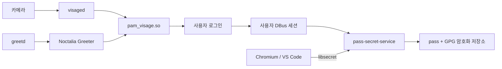

# Visage 로그인과 pass-secret-service 인증 저장소 치트시트

> 환경: Arch Linux, greetd, Noctalia Greeter, Visage, pass-secret-service, Chromium, Visual Studio Code

이 구성은 얼굴 인증과 애플리케이션 비밀 저장을 서로 다른 계층으로 분리한다. Noctalia Greeter는 로그인 화면이고, Visage는 PAM 인증 모듈이다. 로그인 뒤 사용자 세션에서는 `pass-secret-service`가 `pass`와 GPG 저장소를 FreeDesktop Secret Service(`org.freedesktop.secrets`) 인터페이스로 노출한다. Chromium과 VS Code는 이 인터페이스를 통해 쿠키·토큰·자격 증명을 저장한다.



Visage가 확인하는 것은 “로그인할 사용자인가”이며, GPG 개인 키나 `pass` 저장소를 복호화하는 동작이 아니다. 따라서 얼굴 로그인에 성공해도 GPG 키가 잠겨 있으면 애플리케이션이 별도로 GPG 암호를 요구할 수 있다.

## 1. 패키지 설치

```shell
sudo pacman -S --needed pass gnupg libsecret dbus chromium
yay -S --needed pass-secret-service visage noctalia-greeter
```

Chromium과 VS Code의 비밀번호 저장소 백엔드는 `gnome-libsecret`으로 지정한다. VS Code는 배포판별 실행 옵션 파일이나 실행 인자를 사용한다.

```shell
chromium --password-store=gnome-libsecret
code --password-store=gnome-libsecret
```

## 2. 설정 파일

Noctalia Greeter는 인증 요청을 PAM으로 전달하고, PAM 체인의 앞부분에 `pam_visage.so`를 둔다. 얼굴 인증이 실패하거나 카메라를 사용할 수 없을 때는 비밀번호 인증으로 계속 진행해야 한다.

```pam
auth       sufficient   pam_visage.so
auth       include      system-local-login
```

Greeter에서 빈 입력으로 PAM 인증을 시도하는 방식이라면 “빈 비밀번호 허용”은 계정의 빈 비밀번호를 의미하지 않는다. Visage가 성공할 기회를 주는 UI 동작일 뿐이며, 실제 계정 정책과 PAM의 비밀번호 fallback은 별도로 유지한다.

`pass-secret-service`는 사용자 DBus 세션에서 실행되어 Secret Service 이름을 소유해야 한다. GPG 키를 만든 뒤 `pass` 저장소를 해당 키로 초기화한다.

```shell
gpg --full-generate-key
gpg --list-secret-keys --keyid-format LONG
pass init <GPG_KEY_ID>
systemctl --user enable --now pass-secret-service.service
```

Chromium·VS Code가 `gnome-libsecret`을 선택하면 애플리케이션이 직접 GPG 파일을 읽는 대신 Secret Service API를 호출한다. 서비스는 요청을 `pass` 항목으로 매핑하고, `pass`는 GPG로 항목을 암호화한다.

## 3. 서비스 실행 및 확인

```shell
# 사용자 DBus에서 Secret Service가 등록되었는지 확인
busctl --user list | grep -E 'org.freedesktop.secrets|pass'

# 더미 항목으로 저장·조회·삭제를 한 번에 검증
secret-tool store --label='Secret Service test' service cheatsheet account test
secret-tool lookup service cheatsheet account test
secret-tool clear service cheatsheet account test

# 사용자 서비스와 GPG 에이전트 확인
systemctl --user --no-pager status pass-secret-service.service
gpg-connect-agent 'getinfo version' /bye
```

로그인 후 Chromium 또는 VS Code에서 테스트 계정의 세션을 저장하고, 애플리케이션을 완전히 종료한 뒤 다시 실행해 자격 증명이 복원되는지 확인한다. 오류가 있으면 `journalctl --user -u pass-secret-service.service`와 GPG 에이전트 로그를 함께 확인한다.

## 4. 트러블슈팅

!!! warning "얼굴 로그인과 암호 저장소 잠금은 별개"
    Visage의 PAM 성공은 사용자 세션을 열 뿐 GPG 개인 키의 암호를 대신 입력하지 않는다. GPG 키를 보호한 상태에서는 첫 접근 시 PIN entry가 필요할 수 있다. 자동 잠금 해제를 위해 키 암호를 제거하면 노트북 탈취 시 브라우저 토큰과 저장 자격 증명이 함께 노출될 수 있다.

!!! warning "Secret Service는 사용자 세션에서 실행"
    `pass-secret-service`를 root 서비스로 실행하지 않는다. 애플리케이션과 같은 사용자 DBus 세션에서 실행해야 한다. `DBUS_SESSION_BUS_ADDRESS`, `systemctl --user` 상태, `busctl --user list`를 확인하고 로그인 화면의 root 세션과 로그인 후 사용자 세션을 구분한다.

!!! warning "libsecret은 애플리케이션 전체를 보호하지 않음"
    `--password-store=gnome-libsecret`은 자격 증명의 저장 백엔드를 선택할 뿐이다. 악성 확장, 이미 로그인한 세션, 디버깅 인터페이스와 같은 위협을 차단하지 않는다. Chromium 프로필과 VS Code 사용자 데이터를 평문 백업·동기화·공유 대상으로 취급하지 않는다.

!!! warning "백업과 생체 정보"
    GPG 개인 키, 복구용 인증 정보, Visage 얼굴 임베딩 DB와 키는 공용 저장소에 넣지 않는다. 별도의 암호화 백업을 만들고 복구를 시험한다. PAM을 수정할 때는 기존 root 셸이나 TTY를 유지해 그래픽 로그인과 `sudo`가 동시에 잠기지 않게 한다.
